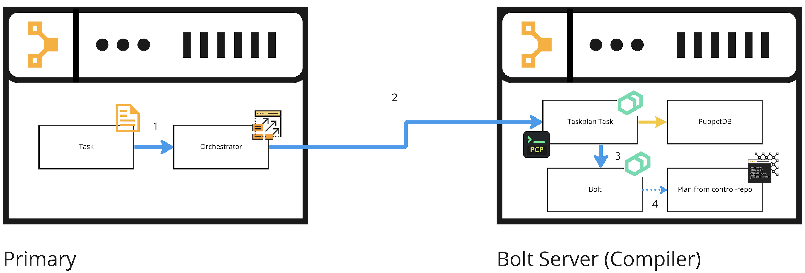
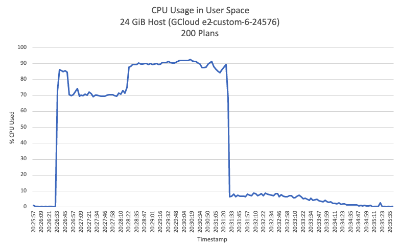
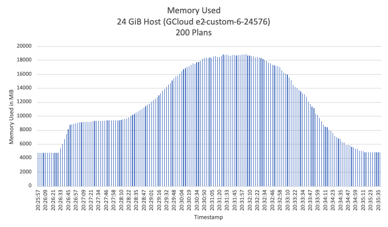

# puppet_bolt_server

This module installs and configures Bolt to use a local PuppetDB and the Puppet Communications Protocol (PCP) transport.

## Table of Contents

1. [Description](#description)
1. [Dependencies](#dependencies)
1. [Installation](#installation)
1. [Usage](#usage)
1. [Limitations](#limitations)

## Description

This module aims to configure a dedicated Puppet Enterprise (PE) compiler to become a Bolt server. The intention is to offload plan execution from Orchestrator on the Primary server to Bolt on the Bolt server. A compiler is ideal because it already has access to PE, Code Manager, and its local PuppetDB.

### What puppet_bolt_server affects

The `puppet_bolt_server` module performs these activities:

* Install Bolt on the node.
* Create the `/root/.puppetlabs/etc/bolt/bolt-defaults.yaml` file with custom configuration to:
    * Use the PCP transport.
    * Use the local PuppetDB for queries.
    * Consume a Puppet token.

## Dependencies

The `puppet_bolt_server` depends on the [`apply_helpers`](https://forge.puppet.com/modules/puppetlabs/apply_helpers/readme) module, it will install helper tasks that are used by the `apply()` function in Bolt.

To install it, make sure to add it to the Puppetfile in your control-repo

```
mod 'puppetlabs-apply_helpers', '0.3.0'
```

## Installation

**Quickstart:** Use the PE console to configure the `puppet_bolt_server` in your existing PE server.

1. Add the [puppetlabs-puppet_bolt_server](https://github.com/puppetlabs/puppetlabs-puppet_bolt_server) to your control repo.
1. Add a new node group in the PE console:

   ```
     Parent name: PE Infrastructure
     Group name: Bolt Server
     Environment: production
   ```

1. Add the `puppet_bolt_server` class to your Bolt Server node group.
1. On the Rules tab, add the dedicated compiler (for running Bolt) to the group. This compiler must not be in the compiler pool for catalog compilation.
1. On the Configuration data tab, add your puppet token (sensitive string).

   ```
    Class: puppet_bolt_server
    Parameter: puppet_token
    Value: '<PUPPET_TOKEN>'
   ```

   - We recommend creating a service user inside PE RBAC and choosing an appropriate lifetime for its token.
   - Use this command to generate a token with a one-year lifetime: `puppet access login --lifetime 1y`
1. Commit your changes.
1. Run Puppet on the Bolt Server node group.

## Usage

After completing the installation steps, your Bolt server should have these files:

- `/root/.puppetlabs/etc/bolt/bolt-defaults.yaml`
- `/root/.puppetlabs/token`

To test that everything is configured properly, you can run any Bolt plan that runs a PuppetDB query, such as this test plan:

```
# /root/Projects/local_plan/plans/test.pp

plan local_plan::test(
){
  $query_results = puppetdb_query("nodes[]{}")
  out::message("Hello world from the Bolt Server, query results: ${query_results}")
}
```

Run the test plan with:

`bolt plan run local_plan::test`

You should get the PuppetDB query results in the terminal. If you inspect the `puppetdb-access.log`, you should find a log with a call to the local PuppetDB returning a `200 OK` HTTP status. For example:

```
$ less /var/log/puppetlabs/puppetdb/puppetdb-access.log

127.0.0.1 - - [01/Nov/2022:15:56:21 +0000] "POST /pdb/query/v4 HTTP/1.1" 200 1793 "-" "HTTPClient/1.0 (2.8.3, ruby 2.7.6 (2022-04-12))" 99 21 -
```

### Run a plan via `taskplan` from the primary server

We recommend installing the [`taskplan` module](https://forge.puppet.com/modules/reidmv/taskplan).

The `taskplan` module allows you to run a task that uses Bolt to run a plan.

#### Run a plan on the Bolt server

This is an overview of the internal process when you offload plan execution from your PE primary server to a Bolt server:

1. Someone requests Orchestrator to run the `taskplan` task on the Bolt server.
1. The `taskplan` task runs on the Bolt server.
1. The task starts Bolt with the `bolt plan run` command.
1. Bolt starts and runs the plan



#### Example 1

This example uses `puppet task run` to run the `taskplan` task on the Bolt server.

Required parameters:

- Choose one of your existing, basic plans or create one that receives a parameter (such as `message`).
- Use your Bolt server's certname.

From the PE primary server CLI, run:

```
puppet task run taskplan --params '{"plan":"<PLAN_NAME>", "params":{"message": "Hello world!"}, "debug":true}' -n <BOLT_SERVER_CERTNAME>
```

This triggers a `taskplan` task run, and the task runs the plan on the Bolt server according to the specified parameters.

This offloads plan execution from Orchestrator to a dedicated Bolt server, which alleviates CPU and memory load on the primary server.

#### Example 2

This example uses the Orchestrator API to trigger a task run. You can do this from any system connected to your PE primary server (over port 8143) and that has a Puppet RBAC token.

Prepare a JSON body to run `taskplan` task, targetting the Bolt server. For example:

```
# test_params.json

{
  "environment" : "production",
  "task" : "taskplan",
  "params" : {
    "plan" : "<PLAN_NAME>",
    "params" : { "message": "Hello world!" },
    "debug" : true
  },
  "scope" : {
    "nodes" : ["<BOLT_SERVER_CERTNAME"]
  }
}
```

Make sure to change the `params.plan`, `params.params`, and the `scope.nodes` according to your own test plan.

Use `curl` to trigger the Ochrestrator API and run the task:

```
auth_header="X-Authentication: $(puppet-access show)"
uri="https://$(puppet config print server):8143/orchestrator/v1/command/task"

curl -d "@test_params.json" --insecure --header "$auth_header" "$uri"
```

## Limitations

- `puppet_bolt_server` is tested only on RHEL 7 and 8 based systems.
- Requires Puppet >= 6.21.0 <= 7.20.0
- This module only supports running plans from the Production environment.
- **Warning:** There is no rate limit to run plans, and you need to pay attention to the VM specification since the available memory is directly related to how many concurrent plans you can run.

## Recommendations

Based on the results of the load test, we know that each additional (concurrent) 50 plans require about 4 GiB to run successfully. As explained in the limitations section, in this early version  `puppet_bolt_server` there are no limits on memory consumption, the bolt processes will continue to use more and more memory until the system becomes completely unresponsive. In our tests, we used 24 GiB of RAM but we noticed the thin margin of memory left during the test, this is dangerous since we could run out of memory.

These are the machine specs of our servers:
  - 24 GiB RAM
  - CPU Intel Broadwell x86/64, 6 cores

Our recommendation is to run a maximum of 200 concurrent plans, allocating **28 GiB RAM** for it, this will give a bit of room in case of unexpected spikes of plans beyond 200.

For education purposes here are two charts that show how the Bolt server will behave in the scenario of running 200 concurrent plans:




